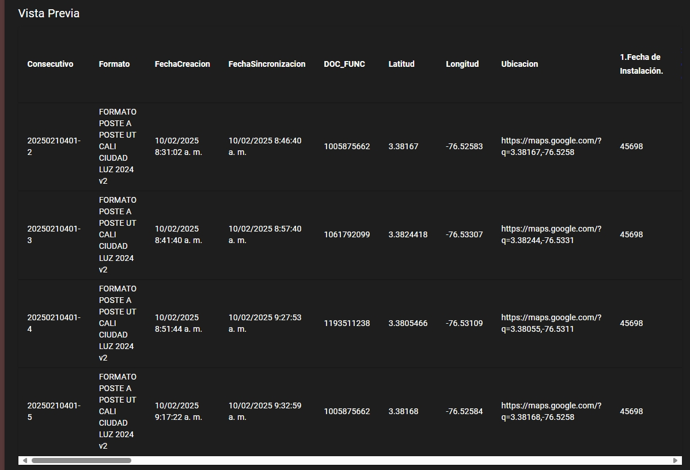
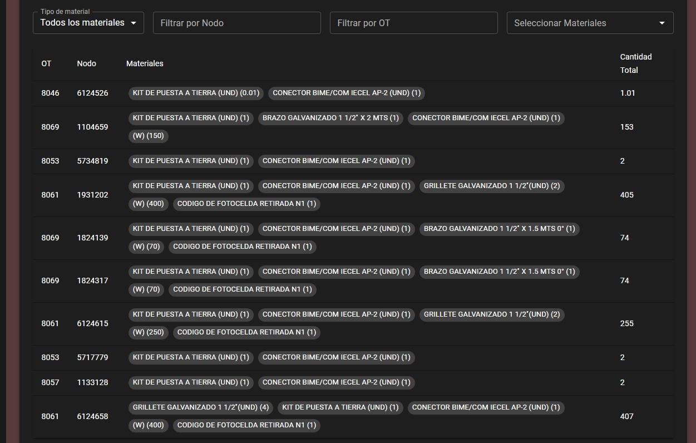
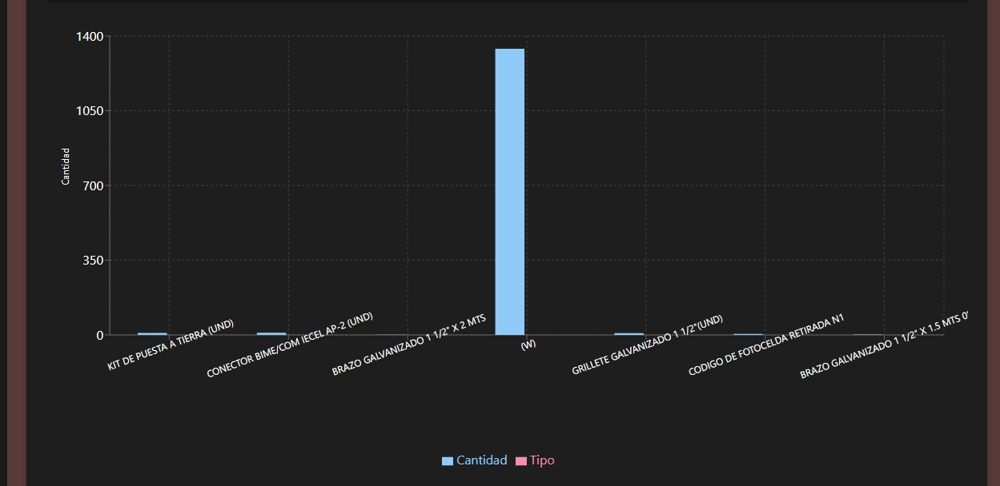

# Analizador de Archivos Técnicos

Aplicación web para procesar y analizar archivos Excel técnicos de proyectos de modernización y mantenimiento de infraestructura.

## Previsualización

### Interfaz Principal


### Seccion vista previa


### Filtrado de Datos


### Resultados Gráficos


### Puedes ingresar para visualizar 
Ingresa el excel que encuentras en el repo para probar el uso de la aplicación: 

## Características Principales

- 📤 Carga de archivos XLSX mediante drag & drop
- 👁️ Vista previa de datos del archivo
- 🎛️ Filtrado por:
  - Tipo de operación (modernización/mantenimiento)
  - Nodo
  - OT
  - Materiales instalados/retirados
- 📊 Visualización gráfica de datos
- 📥 Descarga de resultados procesados
- 🎨 Tema oscuro personalizado
- 🚀 Procesamiento en tiempo real

## Tecnologías Utilizadas

- React.js
- Material UI (v5)
- Recharts para gráficos
- xlsx para procesamiento de Excel
- Axios para comunicación HTTP

## Instalación

1. Clonar el repositorio:
```bash
git clone frontend_analisis
```
2. Instalar dependencias:
```bash
npm install @mui/material @emotion/react @emotion/styled axios react-dropzone xlsx recharts
```
3. Inciar la aplicación:
```bash
npm start
```

## Uso

1. Seleccionar tipo de archivo

- Elegir entre "Modernización" o "Mantenimiento"

2. Carga archivo

- Arrastrar o seleccionar archivo XLSX
- Vista previa automática de las primeras 5 filas

3. Filtrar datos

- Usar los constroles para:

    - Seleccionar tipo de material (todos/instalados/retirados)
    - Filtrar por Nodo u OT
    - Buscar materiales especificos

4. Visualizar resultados

- Tabla con datos procesados
- Gráfico de barras interactivo
- Cantidades totales por material

5. Procesar archivo

- Click en "Procesar Archivo"
- Descarga automatica de resultados en Excel

## Estructura del Código

- State Management:
    - useState para controlar archivos, datos y filtros
    - useDropzone para manejar la subida de archivos

- Procesamiento de Datos:
    - processSheetData(): Normaliza datos del Excel
    - Filtrado combinado por múltiples criterios

- UI Components:
    - Tablas interactivas con Material UI
    - Gráficos dinámicos con Recharts
    - Sistema de filtros combinados

## Configuración

- Tema Oscuro:

Personalizado con createTheme de Material UI
```js
const darkTheme = createTheme({
  palette: {
    mode: 'dark',
    primary: { main: '#90caf9' },
    secondary: { main: '#f48fb1' },
    background: { default: '#593a3a', paper: '#1e1e1e' }
  }
});
```

- API Endpoint:

Configurar en axios.post():
```js
axios.post('https://frontendfastapi.duckdns.org/upload/', ...)
```

## Dependencias

- @mui/material: Componentes UI

- recharts: Gráficos interactivos

- xlsx: Procesamiento de Excel

- react-dropzone: Manejo de subida de archivos

- axios: Peticiones HTTP